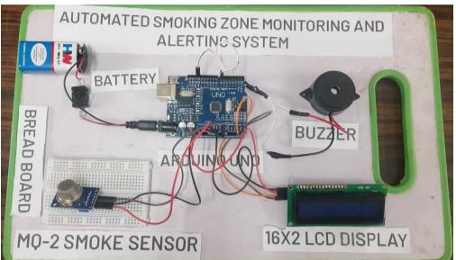
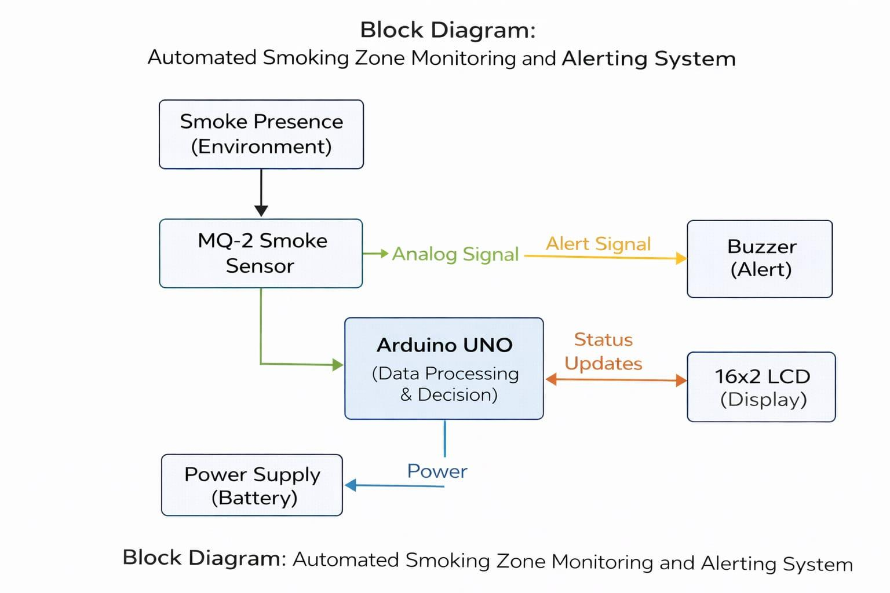
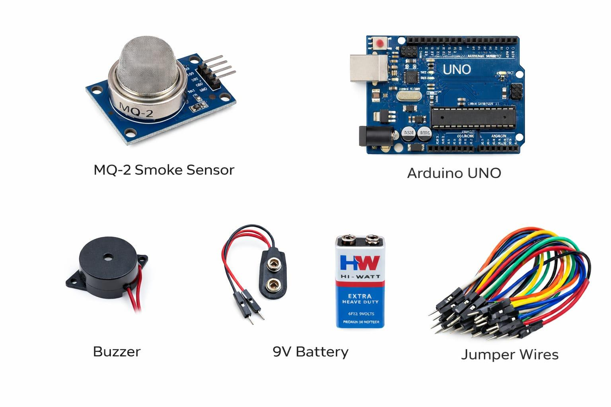
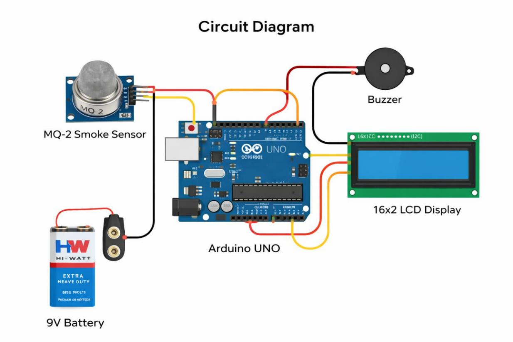
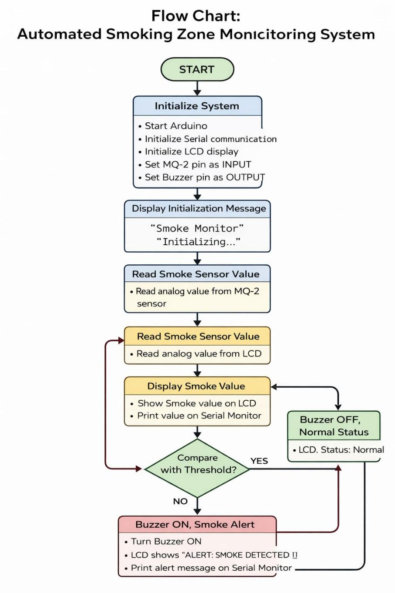

# 🚭 Automated Smoking Zone Monitoring and Alerting System

An Arduino UNO based system that continuously monitors air quality using an MQ-2 smoke sensor and instantly alerts people with a buzzer and an LCD message when smoke crosses a set threshold. Built for no-smoking zones such as offices, hospitals, colleges and malls.

## 📌 Problem
Smoking in restricted areas causes passive smoke exposure, poor indoor air quality and fire risk. Manual supervision and CCTV are labour-intensive and unreliable for real-time detection. This project provides a low-cost, automated, portable alternative.

## ⚙️ How It Works
1. The **MQ-2 sensor** senses smoke/combustible gases and outputs an analog signal.
2. The **Arduino UNO** reads the value on pin `A0` and compares it with a threshold (default `812`).
3. If the value is **below** the threshold, the buzzer stays OFF and the LCD shows `Status: Normal`.
4. If the value is **at or above** the threshold, the buzzer turns ON and the LCD shows `SMOKE DETECTED!`.
5. Readings are also printed to the Serial Monitor (9600 baud) for debugging and calibration.

## 🧰 Components
| Component | Purpose |
|---|---|
| Arduino UNO | Main controller |
| MQ-2 gas/smoke sensor | Smoke detection |
| Active buzzer | Audible alert |
| 16×2 LCD with I2C module | Displays smoke level and status |
| 9V battery | Portable power supply |
| Breadboard + jumper wires | Connections |

## 🔌 Pin Connections
| Device | Arduino Pin |
|---|---|
| MQ-2 (AO) | A0 |
| Buzzer (+) | D7 |
| LCD SDA | A4 |
| LCD SCL | A5 |
| VCC / GND (sensor, LCD) | 5V / GND |

## 💻 Software
- Arduino IDE (C/C++)
- Libraries: `Wire.h`, `LiquidCrystal_I2C.h`
- Code: [`src/smoking_zone_monitor.ino`](src/smoking_zone_monitor.ino)

### Setup
1. Install the **LiquidCrystal_I2C** library from the Arduino Library Manager.
2. Open the `.ino` file and upload it to the Arduino UNO.
3. Let the MQ-2 pre-heat for a few minutes, then open the Serial Monitor (9600 baud).
4. Note the readings in clean air, then adjust `threshold` in the code for your environment.
5. If the LCD stays blank, check the I2C address (`0x27` or `0x3F`) and the contrast screw on the I2C backpack.

## ✅ Results
- Detected smoke from a lighter and incense stick.
- Buzzer and LCD alert triggered in under 2 seconds of smoke detection.
- Stable continuous operation on battery power.
- Accurate within a short range of the sensor.

## ⚠️ Limitations
- Short detection range, so large areas need multiple units.
- May false-trigger on perfume, alcohol sprays or other gases.
- Needs manual threshold calibration and sensor pre-heating.
- No remote alerts or data logging.
- Detects smoke only, and cannot identify the smoker.

## 🚀 Future Scope
- Wi-Fi/GSM alerts (SMS or mobile app)
- Cloud data logging and smoking-pattern analysis
- More selective sensors to reduce false alarms
- Multi-zone monitoring with networked units
- Integration with CCTV / access control

## 👥 Team
Mini-Project (BTC586), Dept. of Electronics & Telecommunication Engineering, Sir M. Visvesvaraya Institute of Technology, Bengaluru (VTU), 2025–26

- Jonas Benedict V Jose
- Kavana N
- K Sri Lakshmi
- Sandhyaa J K

**Guide:** Ms. Madhu Kumari Ray, Assistant Professor, Dept. of ETE

## 📄 License
MIT License, see [LICENSE](LICENSE).
